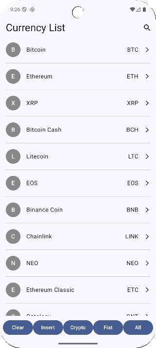
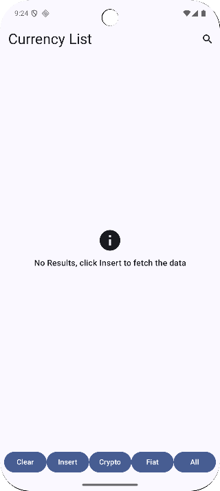
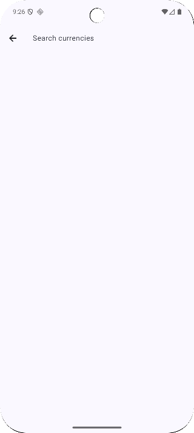
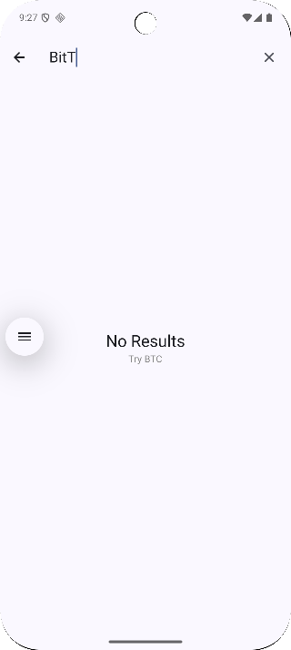
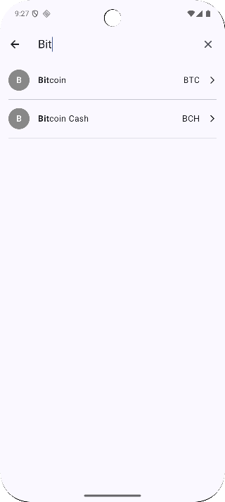

# Currency Demo

This repository contains an Android mobile app and a NestJS backend API for demonstrating a currency list.

## Table of Contents

- [Currency Demo](#currency-demo)
  - [Android App](#android-app)
    - [Setup](#setup)
    - [Running the app](#running-the-app)
  - [Backend (NestJS API)](#backend-nestjs-api)
    - [Installation](#installation)
    - [Running the app](#running-the-app-1)
    - [API Endpoints](#api-endpoints)
      - [Get Currencies](#get-currencies)
      - [Search Currencies](#search-currencies)
  - [Screenshots](#screenshots)

## Android App

This is an Android mobile application built with Jetpack Compose, Hilt, Encrypted Room, Retrofit, OkHttp, Flow, Coroutines, and Kotlin Serialization.

### Setup

1.  **SQLCipher Passphrase:**
    Create or update the `Android/local.properties` file with your desired passphrase:

    ```properties
    sqlcipher.passphrase=your_secret_passphrase_here
    ```

    **Important:** Replace `your_secret_passphrase_here` with a strong, unique passphrase. This file is ignored by Git and should not be committed to version control.

2.  **Run the Backend API (Optional):**
    The application is using a remote API service `https://currency-demo-production.up.railway.app/`. In case you wish to run the backend locally, ensure the NestJS backend API is running as the guide below.

### Running the app

Open the `Android` project in Android Studio and run it on an **Android Emulator**. The app is configured to connect to a remote backend API by default. If you wish to run the backend locally, uncomment the local `BASE_URL` in `Android/app/build.gradle.kts` and comment out the remote one.

```kotlin
        // In case you want to run /Backend project in local
        buildConfigField(
            "String",
            "BASE_URL",
            "\"http://10.0.2.2:3000/\""
        )
```

Running on a physical device would require additional network configuration for the local backend.

Note that `http://10.0.2.2:3000/` is the URL to connect to your laptop's `localhost:3000` from an **Android emulator**. If you want to run on a real mobile device, it is recommended to use the predefined Remote API service.

## Backend (NestJS API)

This is a simple NestJS application to serve mock currency data.

### Installation

Navigate to the `Backend` directory and install dependencies:

```bash
cd Backend
npm install
```

### Running the app

To start the development server:

```bash
cd Backend
npm run start:dev
```

### API Endpoints

#### Get Currencies

Returns a list of currencies.

-   **URL:** `http://localhost:3000/currencies`
-   **Method:** `GET`
-   **Query Parameters:**
    -   `type` (optional): `crypto` or `fiat`. If not provided, all currencies are returned.

##### Examples

**Get all currencies:**

```bash
curl http://localhost:3000/currencies
```

**Get crypto currencies:**

```bash
curl http://localhost:3000/currencies?type=crypto
```

#### Get fiat currencies

```bash
curl http://localhost:3000/currencies?type=fiat
```

#### Search Currencies

Returns a list of currencies matching the search keyword.

-   **URL:** `http://localhost:3000/currencies/search`
-   **Method:** `POST`
-   **Request Body:**
    ```json
    {
      "keyword": "string"
    }
    ```

##### Examples

**Search for currencies with keyword 'eth':**

```bash
curl -X POST -H "Content-Type: application/json" -d '{"keyword": "eth"}' http://localhost:3000/currencies/search
```

## Screenshots

| List Display | List Empty | Search Init | Search Not Found | Search Success |
| :---: | :---: | :---: | :---: | :---: |
|  |  |  |  |  |
